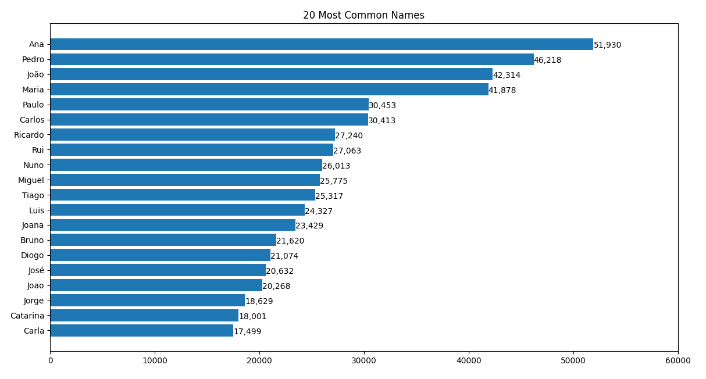
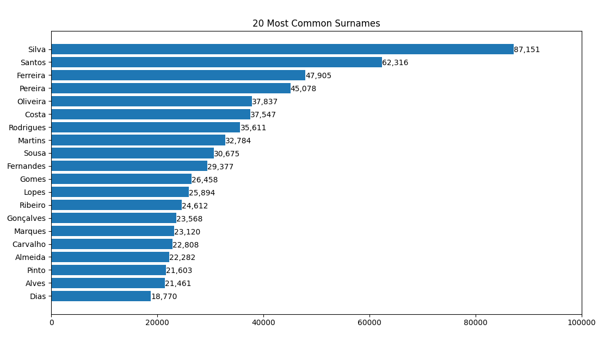
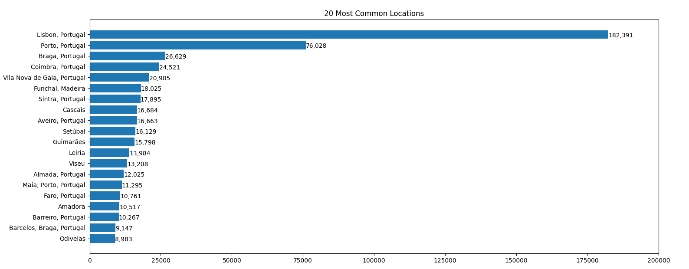
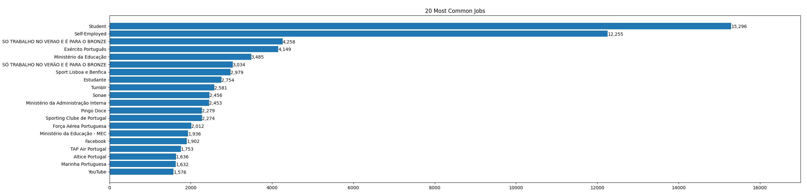

# Facebook-Leak-Data-Metrics

Visualization of the 2019 Facebook data dump (more specifically Portugal). Will not share the actual data here for security and legal reasons.
I used matplotlib and numpy.

