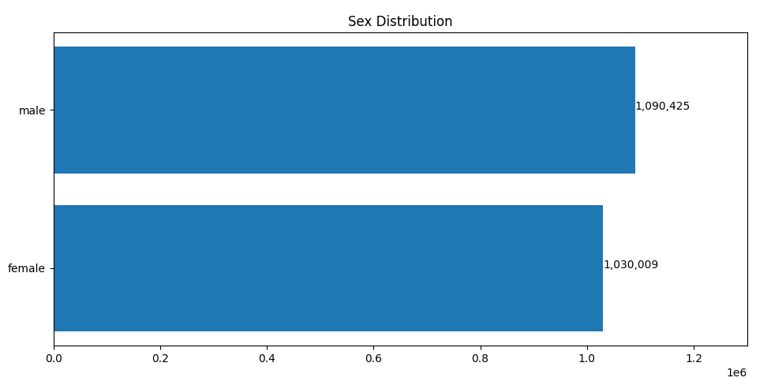
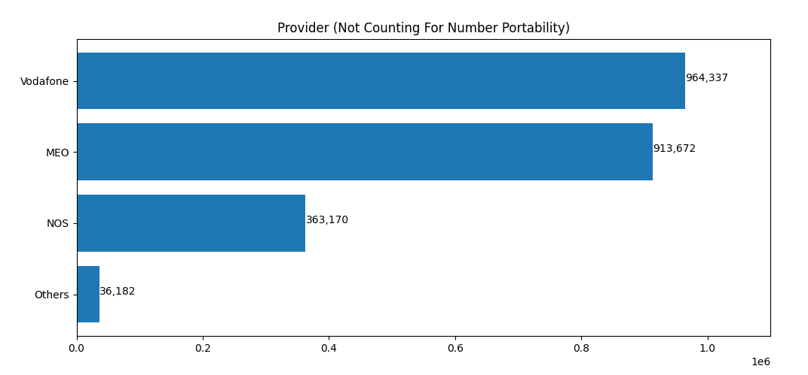

# Facebook-Leak-Data-Metrics

Just learning stuff.

Simple analysis from the 2019 Facebook data dump (more specifically Portugal). Will not share the actual data here for security reasons.

**Warning** Complete garbage spaghetti code

